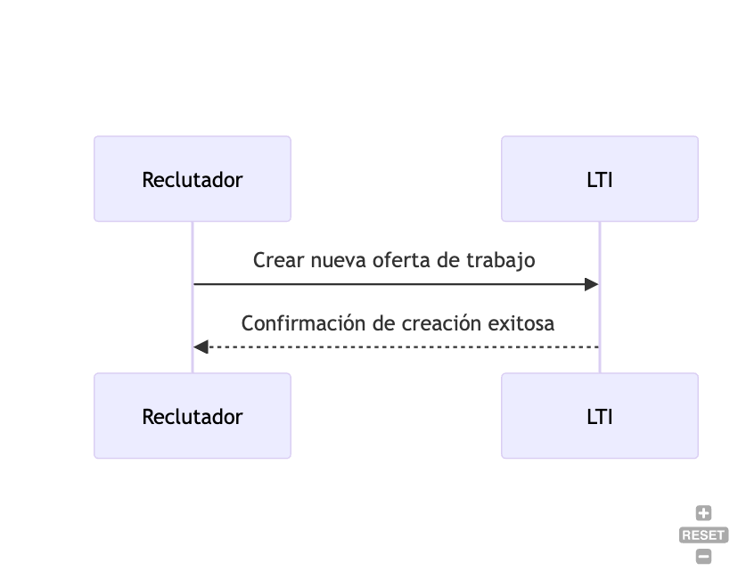
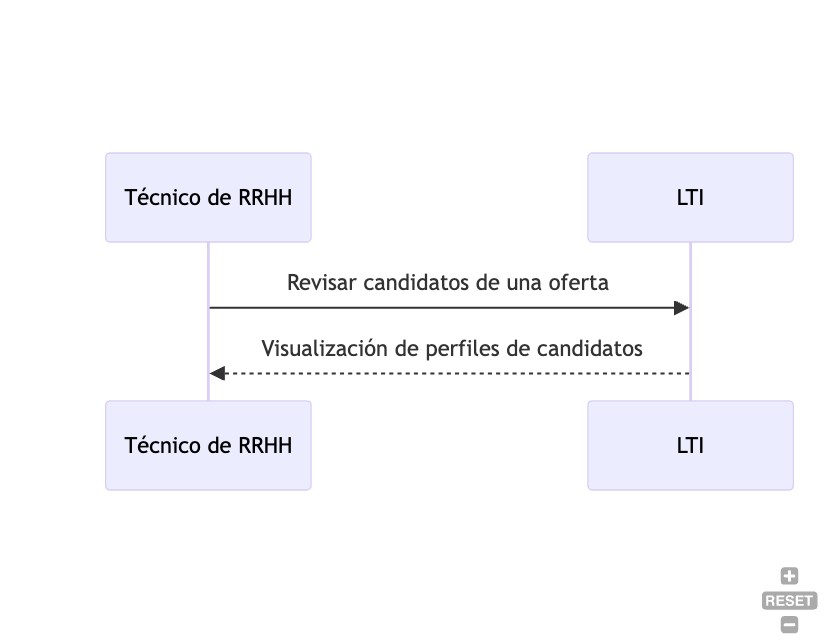
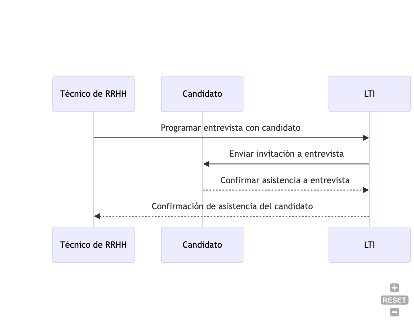

# Sistema de Gestión de Solicitantes (ATS) - Documento de Diseño
## Descripción del Software

LTI es una plataforma avanzada de seguimiento de candidatos diseñada para simplificar y optimizar el proceso de contratación para empresas de todos los tamaños. Al aprovechar tecnologías innovadoras como la inteligencia artificial y el análisis de sentimientos, LTI ofrece una experiencia de reclutamiento única que agiliza la búsqueda, evaluación y selección de talento.

Ventajas Competitivas:

## Valor añadido 

Con LTI, los reclutadores pueden aprovechar algoritmos de inteligencia artificial para encontrar a los candidatos más adecuados para cada posición, mejorar la calidad de las interacciones con los candidatos mediante análisis de sentimientos, y acceder a una plataforma integrada de aprendizaje y desarrollo para impulsar el crecimiento profesional de los empleados.

## Ventajas competitivas

- Inteligencia Artificial para Coincidencia de Candidatos: Algoritmos avanzados de IA que mejoran la precisión y eficiencia en la selección de candidatos.
- Análisis de Sentimientos en Comunicaciones: Mejora la interacción y la experiencia del candidato al proporcionar retroalimentación sobre el tono y la actitud en las comunicaciones.
- Plataforma de Aprendizaje Integrada: Ofrece oportunidades de crecimiento profesional para mejorar la retención y la satisfacción laboral.
- Seguimiento de la Diversidad y la Inclusión: Ayuda a las empresas a mejorar la diversidad y la inclusión en su fuerza laboral mediante la identificación de sesgos y prácticas inclusivas.
- Creación y Gestión de Ofertas de Trabajo: Inicia un ciclo de vida de las ofertas dentro de la aplicación, permitiendo su exportación y publicación en distintas plataformas de reclutamiento.
- Conexión con Plataformas de Tests Online: Integra pruebas de desarrollo de software, preguntas técnicas y psicotécnicas desde plataformas externas y los integra en el perfil del candidato.
- Comunicación y Programación de Entrevistas: Facilita la comunicación entre los reclutadores y los candidatos, generando invitaciones a videollamadas para entrevistas remotas.
- Generación y Firma Digital de Contratos: Crea ofertas de trabajo y contratos personalizados, que pueden ser firmados digitalmente a través de integraciones con Docusign u aplicaciones equivalentes.

## Principales funcionalidades

- Creación y Gestión de Ofertas de Trabajo: Permite a los reclutadores crear, editar y gestionar ofertas de trabajo, incluyendo detalles como el título del puesto, la descripción del trabajo, requisitos y beneficios.
- Exportación y Publicación de Ofertas: Facilita la exportación y publicación de ofertas de trabajo en distintas plataformas de reclutamiento, como sitios web de empleo y redes sociales profesionales.
- Seguimiento del Ciclo de Vida de las Ofertas: Inicia un ciclo de vida para cada oferta de trabajo, que incluye etapas como publicación, recepción de solicitudes, revisión de candidatos y selección final.
- Revisión de Candidatos: Permite a los técnicos de RRHH revisar y gestionar las solicitudes de los candidatos, ver perfiles, evaluar habilidades y experiencia, y tomar decisiones de contratación.
- Integración con Plataformas de Tests Online: Conecta con plataformas de tests online para que los candidatos puedan realizar pruebas de desarrollo de software, preguntas técnicas y psicotécnicas, cuyos resultados se integran automáticamente en sus perfiles.
- Comunicación con los Candidatos: Facilita la comunicación entre los reclutadores y los candidatos a través de mensajes directos, notificaciones y correos electrónicos automáticos.
- Programación de Entrevistas: Permite a los técnicos de RRHH programar entrevistas con los candidatos, incluyendo la generación de invitaciones a videollamadas para entrevistas remotas.
- Generación y Firma Digital de Contratos: Genera ofertas de trabajo personalizadas y contratos de trabajo que pueden ser firmados digitalmente a través de integraciones con herramientas como Docusign.
- Análisis de Datos de Contratación: Ofrece análisis y reportes sobre métricas clave del proceso de contratación, como el tiempo medio de contratación, la tasa de retención y el rendimiento de las fuentes de reclutamiento.
- Seguridad y Cumplimiento: Garantiza la seguridad y privacidad de los datos de los candidatos, cumpliendo con regulaciones como el GDPR, y ofrece funciones de verificación de credenciales mediante tecnologías como la blockchain.

Estas funcionalidades clave de LTI ayudarán a optimizar y mejorar el proceso de contratación para empresas de todos los tamaños.

## Diagrama Lean Canvas para aplicación LTI

| Problema                    | Solución                    | Propuesta de Valor          |
|-----------------------------|-----------------------------|-----------------------------|
| Proceso de contratación     | Plataforma avanzada de      | Inteligencia Artificial     |
| ineficiente y subjetivo     | seguimiento de candidatos   | para la selección de        |
|                             |                             | candidatos                  |
|-----------------------------|-----------------------------|-----------------------------|
| Falta de herramientas para  | Análisis de sentimientos     | Mejora en la interacción    |
| mejorar la interacción con  | en comunicaciones,          | y experiencia del           |
| los candidatos              | plataforma de aprendizaje   | candidato                   |
|                             | integrada, seguimiento de   |                             |
|                             | diversidad y la inclusión,  |                             |
|                             | integración con plataformas |                             |
|                             | de tests online y firma     |                             |
|                             | digital de contratos        |                             |
|-----------------------------|-----------------------------|-----------------------------|
| Dificultad para mejorar la  | Plataforma de aprendizaje   | Mejora en la retención y    |
| diversidad y la inclusión   | integrada, análisis de      | desarrollo del talento      |
| en la fuerza laboral        | sentimientos en             |                             |
|                             | comunicaciones              |                             |
|-----------------------------|-----------------------------|-----------------------------|
| Costos elevados y complejidad| Modelo de negocio SaaS     | Acceso a una solución de    |
| de implementación de ATS    | (Software como Servicio)    | seguimiento de candidatos   |
|                             |                             | rentable y fácil de usar    |
|-----------------------------|-----------------------------|-----------------------------|
| Dificultad para retener y   | Generación y firma digital  | Aumento de la confianza y   |
| desarrollar talento         | de contratos, conexión con  | seguridad mediante          |
|                             | plataformas de tests online | verificación de credenciales|
|-----------------------------|-----------------------------|-----------------------------|
| Dificultad para competir en | Enfoque en la experiencia   | Diferenciación en el        |
| un mercado saturado de ATS  | del usuario, integración    | mercado mediante            |
|                             | con plataformas de tests    | características únicas y    |
|                             | online y firma digital de   | valor agregado              |
|                             | contratos                   |                             |
|-----------------------------|-----------------------------|-----------------------------|
| Preocupaciones sobre la     | Seguimiento de la           | Aumento de la confianza y   | 
| seguridad y la privacidad   | diversidad y la inclusión,  | seguridad mediante          |
| de los datos de los         | tecnología blockchain para  | verificación de credenciales|
| candidatos                  | verificación de credenciales|                             |

## Casos de uso
### Caso de Uso 1: Creación y Gestión de Ofertas de Trabajo
Los reclutadores pueden crear nuevas ofertas de trabajo dentro de la aplicación LTI. Los reclutadores pueden especificar detalles como el título del puesto, la descripción del trabajo, los requisitos y los beneficios. Una vez creada la oferta, pueden gestionarla, editarla o eliminarla según sea necesario.

### Caso de Uso 2: Revisión de Candidatos
En este caso de uso, los técnicos de RRHH revisan las solicitudes de los candidatos que han aplicado a una oferta de trabajo. Pueden ver los perfiles de los candidatos, evaluar sus habilidades y experiencia, y tomar decisiones de contratación, como programar entrevistas o rechazar una solicitud.

### Caso de Uso 2: Programación de Entrevistas
En este caso de uso, los técnicos de RRHH programan entrevistas con los candidatos seleccionados. Pueden enviar invitaciones a los candidatos, incluyendo detalles como la fecha, la hora y el formato de la entrevista (en persona o videollamada). Los candidatos reciben notificaciones automáticas y pueden confirmar su asistencia.

## Modelo de datos