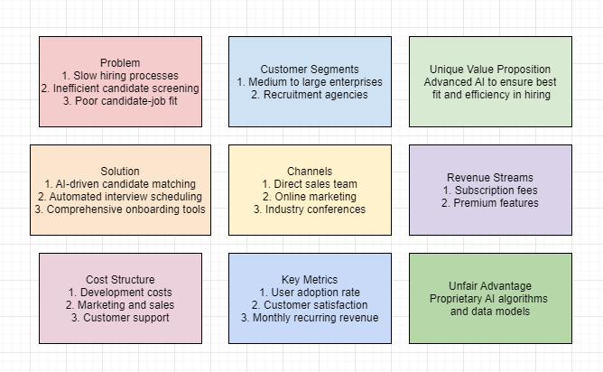
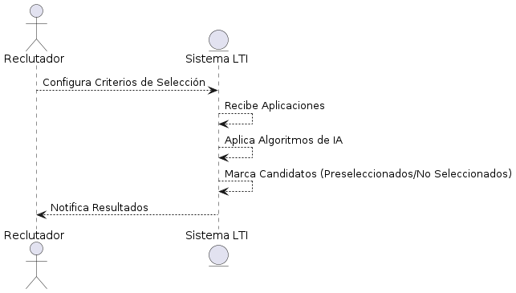
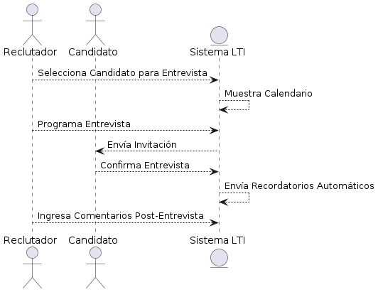
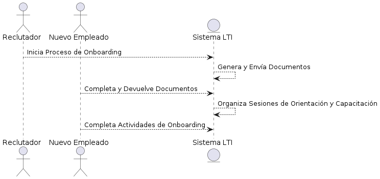
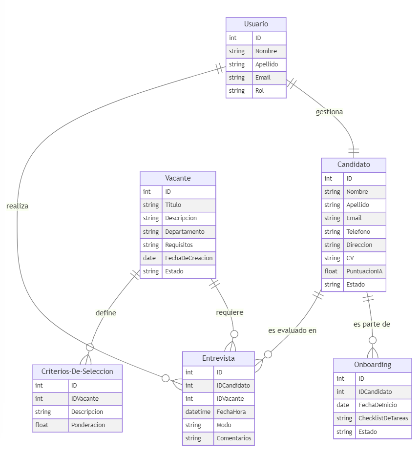
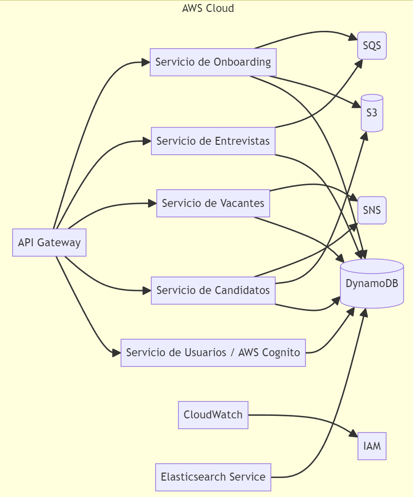
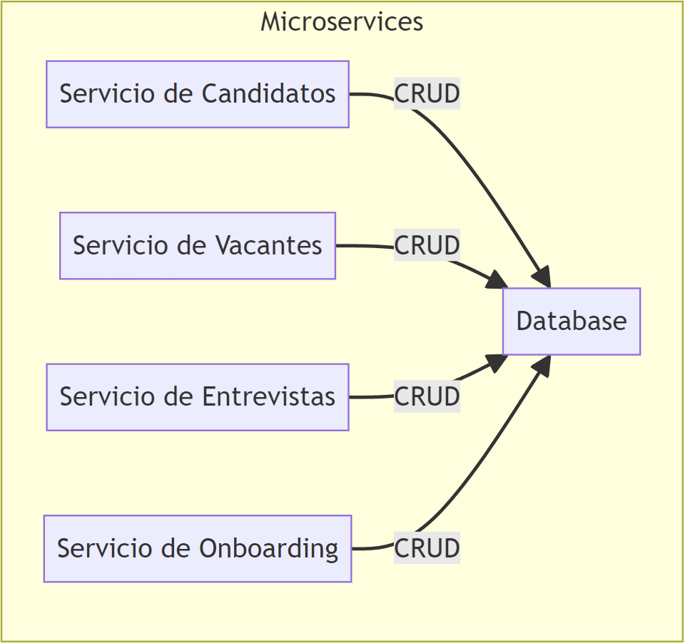
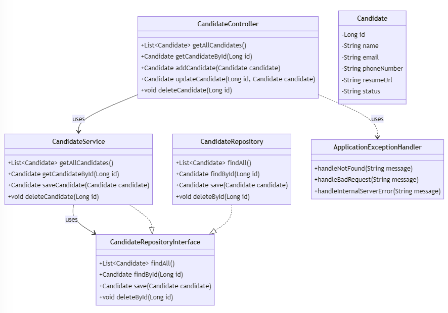

# Descripción de la Startup LTI

## Nombre
LTI (Leading Talent Innovations)

## Descripción del Software
LTI es un sistema de seguimiento de candidatos (ATS) revolucionario diseñado para transformar el proceso de reclutamiento mediante el uso de tecnología avanzada y enfoques centrados en la experiencia del usuario. El software utiliza inteligencia artificial, análisis predictivo y una interfaz altamente personalizable para optimizar el proceso de selección y mejorar la eficiencia operativa de las empresas.

## Valor Añadido
LTI no solo agiliza el proceso de reclutamiento sino que también proporciona insights predictivos sobre el rendimiento potencial de los candidatos y su duración probable en la empresa. Este enfoque proactivo en la selección de candidatos ayuda a las empresas a tomar decisiones más informadas y estratégicas, reduciendo los costos de rotación y mejorando la calidad de las contrataciones.

## Ventajas Competitivas
- **Personalización Extrema**: Cada empresa puede configurar el ATS para que se adapte perfectamente a sus necesidades específicas, incluyendo flujos de trabajo personalizados y paneles de control adaptativos.
- **Integración Profunda**: Compatible con una amplia gama de plataformas HR, redes sociales para el reclutamiento pasivo y herramientas de comunicación, permitiendo una experiencia sin fricciones a lo largo del ciclo de contratación.
- **Funciones de Colaboración Avanzadas**: Facilita la comunicación en tiempo real y la toma de decisiones colaborativa entre los miembros del equipo de reclutamiento.
- **Alto Estándar de Seguridad y Privacidad**: Cumple con las normativas internacionales de protección de datos, asegurando que la información del candidato esté segura y manejada éticamente.
- **Soporte Móvil Completo**: Accesible completamente desde dispositivos móviles, permitiendo a reclutadores y candidatos interactuar con el sistema desde cualquier lugar.

## Funciones Principales
- **Inteligencia Artificial para Preselección de Candidatos**: Algoritmos de IA evalúan candidatos no solo por habilidades técnicas, sino por su compatibilidad con la cultura de la empresa y potencial de crecimiento a largo plazo.
- **Análisis Predictivo**: Provee predicciones sobre el éxito de los candidatos en roles específicos y estimaciones sobre su permanencia, lo que ayuda a anticipar y planificar las necesidades futuras de talento.
- **Interfaz Personalizable**: Usuarios pueden ajustar la interfaz y los flujos de trabajo según las necesidades específicas del equipo de reclutamiento y la organización.
- **Herramientas de Colaboración**: Permite compartir comentarios, calificaciones y discusiones sobre candidatos en tiempo real dentro de la plataforma.
- **Integraciones Seamless**: Se integra con otras herramientas HR, software de onboarding y plataformas de terceros para un flujo de trabajo integrado y eficiente.

LTI busca ser una solución disruptiva en el mercado de los ATS, no solo facilitando el reclutamiento sino también enriqueciendo la gestión del talento a largo plazo mediante tecnología de punta y un enfoque centrado en la calidad y la eficiencia.

## Diagrama Lean Canvas

# Casos de Uso de LTI

## Caso de Uso 1: Preselección Automática de Candidatos

### Descripción
Este caso de uso describe el proceso mediante el cual el sistema LTI utiliza inteligencia artificial para evaluar automáticamente las aplicaciones de los candidatos y seleccionar aquellos que cumplen con criterios predefinidos de habilidades, experiencia y ajuste cultural. El objetivo es agilizar la fase inicial de selección, reduciendo la carga de trabajo manual del equipo de reclutamiento y aumentando la precisión en la identificación de candidatos potencialmente exitosos.

### Actores Principales
- Reclutador
- Sistema LTI

### Precondiciones
- El reclutador ha definido los criterios de selección para la vacante.
- Las aplicaciones de los candidatos están disponibles en el sistema.

### Flujo Principal
1. El reclutador configura los criterios de selección en el sistema LTI.
2. El sistema recibe aplicaciones de los candidatos.
3. LTI aplica algoritmos de IA para analizar las aplicaciones según los criterios establecidos.
4. Los candidatos que cumplen con los criterios son marcados como preseleccionados.
5. El sistema notifica al reclutador los resultados de la preselección.

### Flujos Alternativos
- Si un candidato no cumple con los criterios, el sistema lo marca como no seleccionado y lo almacena para futuras oportunidades.

### Postcondiciones
- Los candidatos preseleccionados son avanzados al siguiente paso del proceso de reclutamiento.

## Caso de Uso 2: Gestión de Entrevistas

### Descripción
Este caso de uso abarca todo el proceso de programación y gestión de entrevistas dentro del sistema LTI. Permite a los reclutadores programar entrevistas, enviar notificaciones a los candidatos y revisar comentarios post-entrevista, facilitando la coordinación y seguimiento eficiente durante el proceso de selección.

### Actores Principales
- Reclutador
- Candidato
- Sistema LTI

### Precondiciones
- El candidato ha sido preseleccionado y avanzado para la entrevista.

### Flujo Principal
1. El reclutador selecciona a un candidato para la entrevista desde el sistema LTI.
2. El sistema muestra un calendario para seleccionar fecha y hora disponibles.
3. El reclutador programa la entrevista y el sistema envía una invitación al candidato.
4. El candidato confirma la entrevista.
5. El sistema envía recordatorios automáticos antes de la entrevista.
6. Post-entrevista, el reclutador ingresa comentarios en el sistema.

### Flujos Alternativos
- Si el candidato necesita reprogramar, el sistema gestiona las nuevas opciones de horario.

### Postcondiciones
- La entrevista se completa y los comentarios están disponibles en el sistema.

## Caso de Uso 3: Onboarding de Candidatos

### Descripción
Este caso de uso describe el proceso de incorporación de nuevos empleados a través del sistema LTI. Desde la aceptación de la oferta hasta el cumplimiento de los requisitos de incorporación, el sistema automatiza y gestiona las tareas para garantizar una transición suave y eficiente para los nuevos empleados.

### Actores Principales
- Reclutador
- Nuevo Empleado
- Sistema LTI

### Precondiciones
- El candidato ha aceptado la oferta de trabajo.

### Flujo Principal
1. El reclutador inicia el proceso de onboarding en el sistema.
2. El sistema genera y envía automáticamente documentos relevantes para ser firmados.
3. El nuevo empleado completa y devuelve los documentos requeridos.
4. El sistema organiza sesiones de orientación y capacitación basadas en el rol del empleado.
5. El nuevo empleado completa todas las actividades de onboarding.

### Flujos Alternativos
- Si falta algún documento, el sistema notifica al nuevo empleado y al reclutador.

### Postcondiciones
- El nuevo empleado está completamente incorporado y listo para comenzar.

# Entidades Principales y Modelo de Relaciones del Sistema LTI

## Entidades Principales

### Candidato
- **Campos**:
  - ID
  - Nombre
  - Apellido
  - Email
  - Teléfono
  - Dirección
  - CV
  - Puntuación IA
  - Estado (preseleccionado, no seleccionado)

### Vacante
- **Campos**:
  - ID
  - Título
  - Descripción
  - Departamento
  - Requisitos
  - Fecha de Creación
  - Estado (abierta, cerrada)

### Criterios de Selección
- **Campos**:
  - ID
  - ID Vacante
  - Descripción
  - Ponderación

### Entrevista
- **Campos**:
  - ID
  - ID Candidato
  - ID Vacante
  - Fecha
  - Hora
  - Modo (presencial, virtual)
  - Comentarios

### Onboarding
- **Campos**:
  - ID
  - ID Candidato
  - Fecha de Inicio
  - Checklist de Tareas
  - Estado (completado, pendiente)

### Usuario (Reclutador)
- **Campos**:
  - ID
  - Nombre
  - Apellido
  - Email
  - Rol

## Modelo de Relaciones

- **Candidato** se relaciona con **Entrevista** mediante `ID Candidato`.
- **Candidato** se relaciona con **Onboarding** mediante `ID Candidato`.
- **Vacante** se relaciona con **Criterios de Selección** mediante `ID Vacante`.
- **Vacante** se relaciona con **Entrevista** mediante `ID Vacante`.
- **Usuario (Reclutador)** se asocia con **Entrevista** y **Onboarding** como el coordinador o gestor de estos procesos.

# Arquitectura General del Sistema LTI

La arquitectura del sistema LTI se basa en un enfoque de microservicios, donde cada servicio gestiona una funcionalidad específica del sistema ATS. Este diseño permite una mayor independencia, escalabilidad, facilidad de actualización y mantenimiento de cada componente sin afectar al resto del sistema. Los microservicios están desarrollados utilizando Java con Spring Boot, proporcionando un marco robusto y escalable para la construcción de aplicaciones empresariales.

## Componentes Clave

### API Gateway
- **Función**: Actúa como la puerta de entrada para todas las llamadas de clientes (frontend y aplicaciones móviles), enrutando hacia los microservicios correspondientes.

### Servicios de Microservicios
- **Tecnología**: Desarrollados en Java con Spring Boot.
- **Servicio de Candidatos**: Gestiona todas las operaciones relacionadas con los candidatos.
- **Servicio de Vacantes**: Administra la creación, actualización y consulta de vacantes.
- **Servicio de Entrevistas**: Controla la programación y gestión de entrevistas.
- **Servicio de Onboarding**: Maneja el proceso de incorporación de los candidatos seleccionados.

### Lambda
- **Función**: Ejecuta código en respuesta a desencadenantes de AWS API Gateway, sin necesidad de administrar servidores.

### DynamoDB
- **Función**: Base de datos NoSQL utilizada para almacenar datos de candidatos, vacantes, entrevistas y procesos de onboarding.

### Cognito
- **Función**: Gestiona la autenticación y el manejo de usuarios, proporcionando un inicio de sesión seguro y gestión de sesiones.

### S3
- **Función**: Almacenamiento de objetos para guardar archivos como CVs, descripciones de puestos y material de onboarding.

### SNS y SQS
- **Función**: Facilitan la gestión de comunicaciones y notificaciones, permitiendo la integración y la orquestación de microservicios de manera asincrónica.

### CloudWatch
- **Función**: Monitorea y alerta sobre el rendimiento de los microservicios.

### Elasticsearch Service
- **Función**: Permite la búsqueda avanzada de candidatos y vacantes basada en múltiples criterios.

### IAM (Identity and Access Management)
- **Función**: Controla el acceso a los recursos de AWS de manera segura.

# Arquitectura del Sistema LTI

## Nivel 1: Diagrama de Contexto

### Propósito
Mostrar cómo el sistema ATS (LTI) interactúa con usuarios externos y otros sistemas.

### Descripción
El sistema LTI se conecta con dos grupos principales: los usuarios (reclutadores y candidatos) y sistemas externos (plataformas de empleo, herramientas HR). La interacción principal con los usuarios se realiza a través de la UI/UX, mientras que el intercambio de datos con los sistemas externos se realiza a través de APIs.

```mermaid
graph TB
    LTI[LTI - Sistema ATS]
    Usuarios[Usuarios Reclutadores, Candidatos]
    SistemasExternos[Sistemas Externos - Plataformas de empleo, Herramientas HR]
    LTI -->|Interacción con UI/UX| Usuarios
    LTI -->|Intercambio de datos| SistemasExternos
    Usuarios -->|Usa| LTI
    SistemasExternos -->|APIs| LTI
``` 

## Nivel 2: Diagrama de Contenedores

### Propósito
Describir los contenedores (aplicaciones y bases de datos) que componen el sistema ATS.

### Descripción
Los principales contenedores dentro del sistema incluyen:
- **API Gateway**: Enruta las solicitudes a los microservicios apropiados.
- **Web Application y Mobile Application (Spring Boot)**: Estas aplicaciones consumen servicios a través del API Gateway.
- **Microservicios (Spring Boot)**: Gestionan la lógica de negocio y operan sobre la base de datos y el almacenamiento de archivos.
- **Base de Datos (DynamoDB)**: Almacena toda la información relativa a candidatos, vacantes, entrevistas y onboarding.
- **Almacenamiento de Archivos (S3)**: Guarda archivos como CVs y material de onboarding.

```mermaid
graph TB
    APIGateway[API Gateway]
    WebApp[Web Application]
    MobileApp[Mobile Application]
    Microservices[Microservicios - Spring Boot]
    Database[Base de Datos DynamoDB]
    FileStorage[Almacenamiento de Archivos S3]

    APIGateway -->|Enruta solicitudes| Microservices
    WebApp -->|Consume| APIGateway
    MobileApp -->|Consume| APIGateway
    Microservices -->|Lee/escribe| Database
    Microservices -->|Almacena/recupera| FileStorage
```

## Nivel 3: Diagrama de Componentes

### Propósito
Detallar los componentes dentro de cada microservicio creado con Spring Boot.

### Descripción
Cada microservicio está diseñado para manejar aspectos específicos del sistema:
- **Servicio de Candidatos**: Maneja operaciones CRUD para datos de candidatos.
- **Servicio de Vacantes**: Administra datos de vacantes.
- **Servicio de Entrevistas**: Gestiona la programación y realización de entrevistas.
- **Servicio de Onboarding**: Controla el proceso de incorporación de nuevos empleados.

```mermaid
graph TB
    subgraph Microservices
        CandidateService[Servicio de Candidatos]
        JobService[Servicio de Vacantes]
        InterviewService[Servicio de Entrevistas]
        OnboardingService[Servicio de Onboarding]

        CandidateService -->|CRUD| Database
        JobService -->|CRUD| Database
        InterviewService -->|CRUD| Database
        OnboardingService -->|CRUD| Database
    end
```

## Nivel 4: Diagrama de Código

### Propósito
Mostrar las clases y las relaciones entre ellas dentro del servicio de candidatos como ejemplo.

### Descripción de Componentes
- **CandidateController**: Clase que actúa como el punto de entrada para las solicitudes HTTP relacionadas con los candidatos. Expone métodos para obtener, agregar, actualizar y eliminar candidatos. Usa la clase `CandidateService` para procesar la lógica de negocio.
- **CandidateService**: Servicio que contiene la lógica de negocio para manejar las operaciones sobre candidatos. Este servicio utiliza una interfaz `CandidateRepositoryInterface` para interactuar con la capa de persistencia, lo que facilita la desacoplación y mejora la capacidad de prueba del código.
- **CandidateRepository**: Implementa la interfaz `CandidateRepositoryInterface` y es responsable de todas las operaciones de base de datos para la entidad `Candidate`, usando Spring Data JPA para reducir la necesidad de código boilerplate.
- **Candidate**: Clase de dominio que representa la entidad Candidato con sus propiedades como id, nombre, email, etc., y se mapea a una tabla de base de datos mediante JPA.
- **CandidateRepositoryInterface**: Una interfaz que define los métodos para acceder a los datos de los candidatos. Esto abstrae la implementación del repositorio del servicio que lo utiliza, permitiendo cambios más fáciles en la implementación de la persistencia si es necesario.
- **ApplicationExceptionHandler**: Un manejador global de excepciones que captura y maneja las excepciones lanzadas por los controladores, proporcionando respuestas HTTP adecuadas. Esto centraliza el manejo de errores y reduce la duplicación de código de manejo de errores en los controladores.

```mermaid
classDiagram
    class CandidateController {
        +List~Candidate~ getAllCandidates()
        +Candidate getCandidateById(Long id)
        +Candidate addCandidate(Candidate candidate)
        +Candidate updateCandidate(Long id, Candidate candidate)
        +void deleteCandidate(Long id)
    }

    class CandidateService {
        +List~Candidate~ getAllCandidates()
        +Candidate getCandidateById(Long id)
        +Candidate saveCandidate(Candidate candidate)
        +void deleteCandidate(Long id)
    }

    class CandidateRepository {
        +List~Candidate~ findAll()
        +Candidate findById(Long id)
        +Candidate save(Candidate candidate)
        +void deleteById(Long id)
    }

    class Candidate {
        -Long id
        -String name
        -String email
        -String phoneNumber
        -String resumeUrl
        -String status
    }

    class CandidateRepositoryInterface {
        +List~Candidate~ findAll()
        +Candidate findById(Long id)
        +Candidate save(Candidate candidate)
        +void deleteById(Long id)
    }

    CandidateController --> CandidateService : uses
    CandidateService --> CandidateRepositoryInterface : uses
    CandidateRepository ..|> CandidateRepositoryInterface
    CandidateRepositoryInterface <|.. CandidateService

    class ApplicationExceptionHandler {
        +handleNotFound(String message)
        +handleBadRequest(String message)
        +handleInternalServerError(String message)
    }

    CandidateController ..> ApplicationExceptionHandler : uses
```

### Explicación General
- **Nivel 1 (Contexto)**: Ilustra las interacciones externas del sistema.
- **Nivel 2 (Contenedores)**: Muestra cómo se estructuran las aplicaciones y los datos.
- **Nivel 3 (Componentes)**: Desglosa la funcionalidad interna de los microservicios.
- **Nivel 4 (Código)**: Detalla la implementación del código dentro de un servicio específico.

